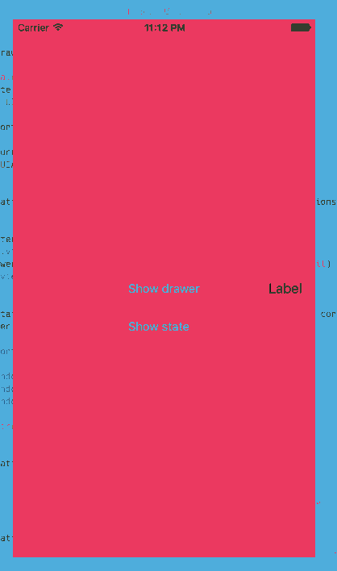

# SASlideDrawer
Allows for a "drawer" view to pan and show above a "content" view.

## Description
The **content view controller** contains the main area of focus on the screen.

The **drawer view controller** contains the area of the screen that can slide 
 out and back in. It is meant for things like an auxiliary panel or a navigation
 menu.

### Demo
